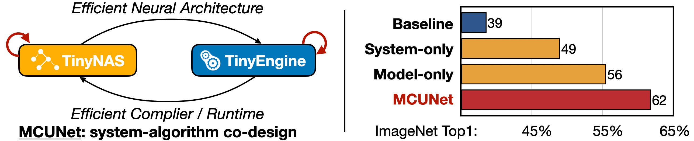
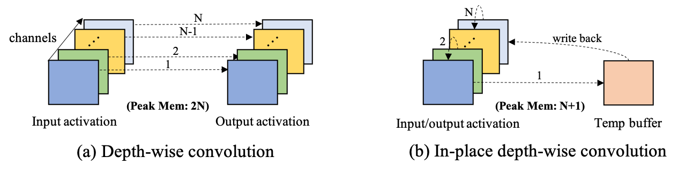
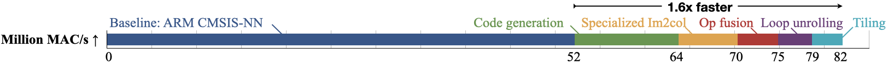
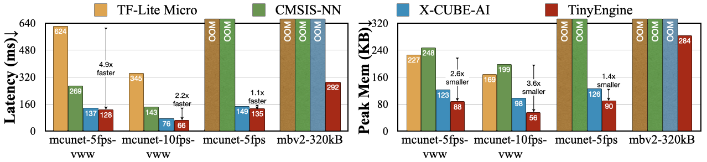
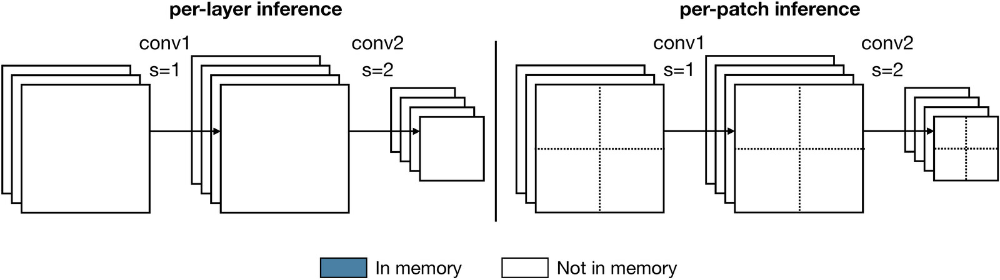
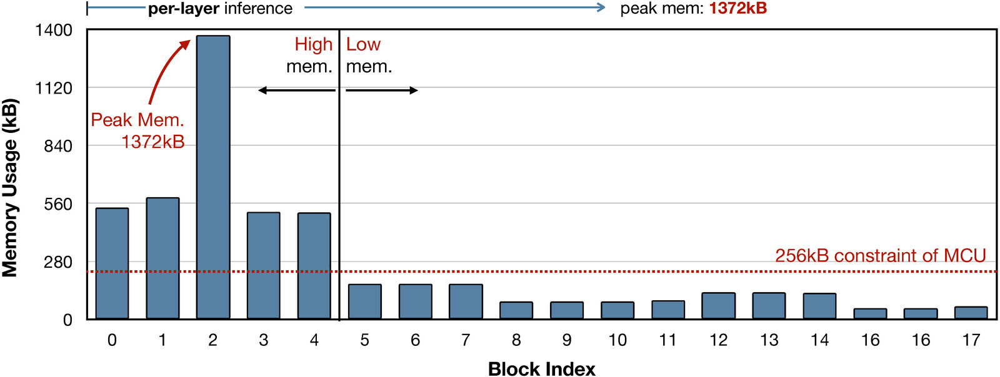
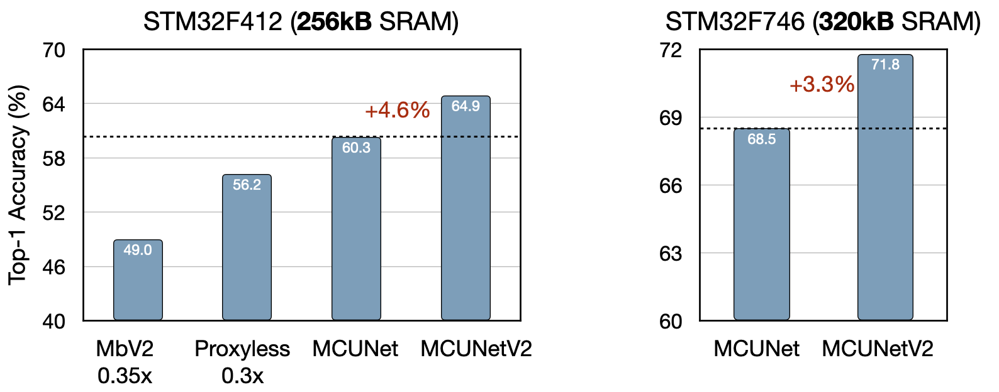

# TinyEngine

This is the official implementation of TinyEngine, a memory-efficient and high-performance neural network library for Microcontrollers.
TinyEngine is a part of MCUNet, which also consists of TinyNAS. MCUNet is a system-algorithm co-design framework for tiny deep learning on microcontrollers. TinyEngine and TinyNAS are co-designed to fit the tight memory budgets.

**The MCUNet and TinyNAS repo is [here](https://github.com/mit-han-lab/mcunet).**

### [TinyML Project Website](https://hanlab.mit.edu/projects/tinyml) | [MCUNetV1](https://hanlab.mit.edu/projects/mcunet) | [MCUNetV2](https://hanlab.mit.edu/projects/mcunetv2) | [MCUNetV3](https://hanlab.mit.edu/projects/mcunetv3)

### [Demo (Inference)](https://www.youtube.com/watch?v=F4XKn0iDfxg)


### [Demo (Training)](https://www.youtube.com/watch?v=0pUFZYdoMY8)


## News

**If you are interested in getting updates, please sign up [here](https://forms.gle/UW1uUmnfk1k6UJPPA) to get notified!**

- **(2024/03)** We release a [new demo video](https://www.youtube.com/watch?v=0pUFZYdoMY8) of [On-Device Training Under 256KB Memory](https://arxiv.org/abs/2206.15472).
- **(2023/10)** [Tiny Machine Learning: Progress and Futures \[Feature\]](https://hanlab.mit.edu/projects/tinyml-magazine) appears at IEEE CAS Magazine.
- **(2023/02)** We now support running [the inference tutorial](tutorial/inference) without an Arducam. Feel free to give it a try!
- **(2023/02)** We release the source code of the [person detection demo](examples/openmv_person_detection), [face mask detection demo](examples/openmv_face_mask_detection), and [on-device training demo](examples/openmv_training_sparse) on OpenMV Cam H7.
- **(2022/12)** We update the [measured results](README.md#measured-results) on STM32H743 with the new versions of the inference libraries.
- **(2022/12)** We release the source code for patch-based inference and update the [tutorial of our inference demo](tutorial/inference/README.md) to provide option that generates patch-based inference code for the visual wake words (VWW) demo.
- **(2022/11)** We release the source code of Tiny Training Engine, and include the [tutorial of our training demo](tutorial/training) for training a visual wake words (VWW) model on microcontrollers.
- **(2022/11)** We release the source code of the algorithm and compilation parts of MCUNetV3 in [this repo](https://github.com/mit-han-lab/tiny-training). Please take a look!
- **(2022/10)** Our new work [On-Device Training Under 256KB Memory](https://arxiv.org/abs/2206.15472) is highlighted on the [MIT homepage](http://web.mit.edu/spotlight/learning-edge/)!
- **(2022/09)** Our new work [On-Device Training Under 256KB Memory](https://arxiv.org/abs/2206.15472) is accepted to NeurIPS 2022! It enables tiny on-device training for IoT devices.
- **(2022/08)** Our **New Course on TinyML and Efficient Deep Learning** will be released soon in September 2022: [efficientml.ai](https://efficientml.ai/).
- **(2022/08)** We include the [tutorial of our inference demo](tutorial/inference) for deploying a visual wake words (VWW) model onto microcontrollers.
- **(2022/08)** We opensource the TinyEngine repo.
- **(2022/07)** We include the person detection model used in the video demo above in the [MCUNet repo](https://github.com/mit-han-lab/mcunet).
- **(2022/06)** We refactor the [MCUNet repo](https://github.com/mit-han-lab/mcunet) as a standalone repo (previous repo: https://github.com/mit-han-lab/tinyml)
- **(2021/10)** **MCUNetV2** is accepted to NeurIPS 2021: https://arxiv.org/abs/2110.15352 !
- **(2020/10)** **MCUNet** is accepted to NeurIPS 2020 as **spotlight**: https://arxiv.org/abs/2007.10319 !
- Our projects are covered by: [MIT Spotlight News (v3)](http://web.mit.edu/spotlight/learning-edge/), [MIT News (v2)](https://news.mit.edu/2021/tiny-machine-learning-design-alleviates-bottleneck-memory-usage-iot-devices-1208), [MIT News (v1)](https://news.mit.edu/2020/iot-deep-learning-1113), [WIRED](https://www.wired.com/story/ai-algorithms-slimming-fit-fridge/), [Morning Brew](https://www.morningbrew.com/emerging-tech/stories/2020/12/07/researchers-figured-fit-ai-ever-onto-internet-things-microchips), [Stacey on IoT](https://staceyoniot.com/researchers-take-a-3-pronged-approach-to-edge-ai/), [Analytics Insight](https://www.analyticsinsight.net/amalgamating-ml-and-iot-in-smart-home-devices/), [Techable](https://techable.jp/archives/142462), etc.

## Overview

Microcontrollers are low-cost, low-power hardware. They are widely deployed and have wide applications, but the tight memory budget (50,000x smaller than GPUs) makes deep learning deployment difficult.

MCUNet is a **system-algorithm co-design** framework for tiny deep learning on microcontrollers. It consists of **TinyNAS** and **TinyEngine**. They are co-designed to fit the tight memory budgets. With system-algorithm co-design, we can significantly improve the deep learning performance on the same tiny memory budget.



Specifically, TinyEngine is a memory-efficient inference library. TinyEngine adapts the memory scheduling according to the overall network topology rather than layer-wise optimization, reducing memory usage and accelerating the inference. It outperforms existing inference libraries such as [TF-Lite Micro](https://www.tensorflow.org/lite/microcontrollers) from Google, [CMSIS-NN](https://arxiv.org/abs/1801.06601) from Arm, and [X-CUBE-AI](https://www.st.com/en/embedded-software/x-cube-ai.html) from STMicroelectronics.

TinyEngine adopts the following optimization techniques to accelerate inference speed and minimize memory footprint.

- [**In-place depth-wise convolution**](https://mcunet.mit.edu/#mcunetv1): A unique data placement technique for depth-wise convolution that overwrites input data by intermediate/output data to reduce peak SRAM memory.
- [**Patch-based inference**](https://mcunet.mit.edu/#mcunetv2): A generic patch-by-patch inference scheduling, which operates only on a small spatial region of the feature map and significantly cuts down the peak memory.
- [**Operator fusion**](https://docs.microsoft.com/en-us/windows/ai/directml/dml-fused-activations): A method that improves performance by merging one operator into a different operator so that they are executed together without requiring a roundtrip to memory.
- [**SIMD (Single instruction, multiple data) programming**](https://en.wikipedia.org/wiki/Single_instruction,_multiple_data): A computing method that performs the same operation on multiple data points simultaneously.
- [**HWC to CHW weight format transformation**](https://oneapi-src.github.io/oneDNN/dev_guide_understanding_memory_formats.html): A weight format transformation technique that increases cache hit ratio for in-place depth-wise convolution.
- [**Image to Column (Im2col) convolution**](https://iq.opengenus.org/im2col/): An implementation technique of computing convolution operation using general matrix multiplication (GEMM) operations.
- [**Loop reordering**](https://xilinx.github.io/Vitis_Accel_Examples/2019.2/html/loop_reorder.html): A loop transformation technique that attempts to optimize a program's execution speed by reordering/interchanging the sequence of loops.
- [**Loop unrolling**](https://en.wikipedia.org/wiki/Loop_unrolling): A loop transformation technique that attempts to optimize a program's execution speed at the expense of its binary size, which is an approach known as space-time tradeoff.
- [**Loop tiling**](https://en.wikipedia.org/wiki/Loop_nest_optimization): A loop transformation technique that attempts to reduce memory access latency by partitioning a loop's iteration space into smaller chunks or blocks, so as to help ensure data used in a loop stays in the cache until it is reused.



By adopting the abovementioned optimization techniques, TinyEngine can not only enhance inference speed but also reduce peak memory, as shown in the figures below.

**MAC/s improvement breakdown:**


**Peak memory reduction:**


To sum up, our **TinyEngine** inference engine could be a useful infrastructure for MCU-based AI applications. It significantly **improves the inference speed and reduces the memory usage** compared to existing libraries like [TF-Lite Micro](https://www.tensorflow.org/lite/microcontrollers), [CMSIS-NN](https://arxiv.org/abs/1801.06601), [X-CUBE-AI](https://www.st.com/en/embedded-software/x-cube-ai.html), etc. It improves the inference speed by **1.1-18.6x**, and reduces the peak memory by **1.3-3.6x**.



**Save Memory with Patch-based Inference:**
We can dramastically reduce the inference peak memory by using patch-based inference for the memory-intensive stage of CNNs.


For MobileNetV2, using patch-based inference allows us to reduce the peak memory by 8x.


With patch-based infernece, tinyengine achieves higher accuracy at the same memory budgets.


## Code Structure

`code_generator` contains a python library that is used to compile neural networks into low-level source code (C/C++).

`TinyEngine` contains a C/C++ library that implements operators and performs inference on Microcontrollers.

`examples` contains the examples of transforming TFLite models into our TinyEngine models.

`tutorial` contains the demo tutorial (of inference and training) of deploying a visual wake words (VWW) model onto microcontrollers.

`assets` contains misc assets.

## Requirement

- Python 3.6+
- STM32CubeIDE 1.5+

## Setup for Users

First, clone this repository:

```bash
git clone --recursive https://github.com/mit-han-lab/tinyengine.git
```

(Optional) Using a virtual environment with `conda` is recommended.

```bash
conda create -n tinyengine python=3.6 pip
conda activate tinyengine
```

Install dependencies:

```bash
pip install -r requirements.txt
```

## Setup for Developers

Install pre-commit hooks to automatically format changes in your code.

```
pre-commit install
```

## Deployment Example

Please see [tutorial](tutorial) to learn how to deploy a visual wake words (VWW) model onto microcontrollers by using TinyEngine. We include both [the inference demo](tutorial/inference) and [the training demo](tutorial/training) in the tutorial, please take a look!

## Measured Results

- All the tflite models are from [Model Zoo in MCUNet repo](https://github.com/mit-han-lab/mcunet#model-zoo). Please see MCUNet repo to know how to build the pre-trained int8 quantized models in TF-Lite format.
- All the **latency**, **peak memory (SRAM)** and **Flash memory usage** results are profiled on STM32H743 with the limitations of 512 KB peak memory and 2 MB storage.
- Note that we measure the newer versions of libraries in this repo, so that the results in this repo might be different from the ones in the MCUNet papers.
- For each inference library, we use the git commit ID to indicate the version.
- All the tflite models are compiled by `-Ofast` optimization level in STM32CubeIDE.
- OOM denotes Out Of Memory.
- Measurement for X-Cube-AI v7.3.0 was conducted with the default compilation setting of balanced mode.

The **latency** results:

| net_id                       | TF-Lite Micro<br>[@ 713b6ed](https://github.com/tensorflow/tflite-micro/tree/713b6ed6bd81d8d6906d885e14f444aaf9c154f6) | CMSIS-NN<br>[@ 011bf32](https://github.com/ARM-software/CMSIS-NN/tree/011bf3228a64cd70ba6bfac91ac6840a88b829ee) | X-CUBE-AI<br>v7.3.0 | TinyEngine<br>[@ 0363956](https://github.com/mit-han-lab/tinyengine/tree/03639563ebf6538fff557515e31667fca6448cd3) |
| ---------------------------- | ----------------------- | ------------------ | --------- | ---------- |
| *# mcunet models (VWW)*      |                         |                    |           |            |
| mcunet-vww0                  |          587ms          |        53ms        |   32ms    |   27ms    |
| mcunet-vww1                  |          1120ms         |        97ms        |    57ms   |    51ms    |
| mcunet-vww2                  |          5310ms         |        478ms       |   269ms   |   234ms    |
| *# mcunet models (ImageNet)* |                         |                    |           |            |
| mcunet-in0                   |           586ms         |         51ms       |   35ms    |   25ms    |
| mcunet-in1                   |           1227ms        |         103ms      |    63ms   |    56ms    |
| mcunet-in2                   |           6463ms        |         642ms      |   351ms   |   280ms    |
| mcunet-in3                   |           7821ms        |         770ms      |    414ms  |   336ms    |
| mcunet-in4                   |           OOM           |         OOM        |    516ms  |   463ms    |
| *# baseline models*          |                         |                    |           |            |
| proxyless-w0.3-r64              |          512ms         |        54kB      |  35kB   |   23kB    |
| proxyless-w0.3-r176               |           3801ms        |         380ms      |   205ms   |   176ms    |
| mbv2-w0.3-r64                   |           467ms         |        43ms      |  29ms   |   23ms    |


The **peak memory (SRAM)** results:

| net_id                       | TF-Lite Micro<br>[@ 713b6ed](https://github.com/tensorflow/tflite-micro/tree/713b6ed6bd81d8d6906d885e14f444aaf9c154f6) | CMSIS-NN<br>[@ 011bf32](https://github.com/ARM-software/CMSIS-NN/tree/011bf3228a64cd70ba6bfac91ac6840a88b829ee) | X-CUBE-AI<br>v7.3.0 | TinyEngine<br>[@ 0363956](https://github.com/mit-han-lab/tinyengine/tree/03639563ebf6538fff557515e31667fca6448cd3) |
| ---------------------------- | ----------------------- | ------------------ | --------- | ---------- |
| *# mcunet models (VWW)*      |                         |                    |           |            |
| mcunet-vww0                  |          163kB          |        163kB       |   88kB    |   59kB     |
| mcunet-vww1                  |          220kB          |        220kB       |   113kB   |    92kB    |
| mcunet-vww2                  |          385kB          |        390kB       |   201kB   |   174kB    |
| *# mcunet models (ImageNet)* |                         |                    |           |            |
| mcunet-in0                   |           161kB         |        161kB       |   69kB    |   49kB     |
| mcunet-in1                   |           219kB         |        219kB       |   106kB   |   96kB     |
| mcunet-in2                   |           460kB         |        469kB       |   238kB   |   215kB    |
| mcunet-in3                   |           493kB         |        493kB       |    243kB  |   260kB    |
| mcunet-in4                   |           OOM           |         OOM        |    342kB  |   416kB    |
| *# baseline models*          |                         |                    |           |            |
| proxyless-w0.3-r64              |          128kB         |        136kB      |  97kB   |   35kB    |
| proxyless-w0.3-r176              |           453kB         |        453kB       |   221kB   |   259kB    |
| mbv2-w0.3-r64                   |           173kB         |        173kB      |  88kB   |   61kB    |

The **Flash memory usage** results:

| net_id                       | TF-Lite Micro<br>[@ 713b6ed](https://github.com/tensorflow/tflite-micro/tree/713b6ed6bd81d8d6906d885e14f444aaf9c154f6) | CMSIS-NN<br>[@ 011bf32](https://github.com/ARM-software/CMSIS-NN/tree/011bf3228a64cd70ba6bfac91ac6840a88b829ee) | X-CUBE-AI<br>v7.3.0 | TinyEngine<br>[@ 0363956](https://github.com/mit-han-lab/tinyengine/tree/03639563ebf6538fff557515e31667fca6448cd3) |
| ---------------------------- | ----------------------- | ------------------ | --------- | ---------- |
| *# mcunet models (VWW)*      |                         |                    |           |            |
| mcunet-vww0                  |          627kB          |        646kB       |   463kB   |   453kB    |
| mcunet-vww1                  |          718kB          |        736kB       |   534kB   |   521kB    |
| mcunet-vww2                  |         1016kB          |        1034kB      |   774kB   |   741kB    |
| *# mcunet models (ImageNet)* |                         |                    |           |            |
| mcunet-in0                   |          1072kB         |        1090kB      |   856kB   |   842kB    |
| mcunet-in1                   |           937kB         |        956kB       |   737kB   |   727kB    |
| mcunet-in2                   |          1084kB         |        1102kB      |   849kB   |   830kB    |
| mcunet-in3                   |          1091kB         |        1106kB      |    867kB  |   835kB    |
| mcunet-in4                   |           OOM           |         OOM        |    1843kB |  1825kB    |
| *# baseline models*          |                         |                    |           |            |
| proxyless-w0.3-r64              |          1065kB         |        1084kB      |   865kB   |   777kB    |
| proxyless-w0.3-r176              |          1065kB         |        1084kB      |   865kB   |   779kB    |
| mbv2-w0.3-r64                   |           940kB           |         959kB        |    768kB  |   690kB    |

## Citation

If you find the project helpful, please consider citing our paper:

```
@article{
  lin2020mcunet,
  title={Mcunet: Tiny deep learning on iot devices},
  author={Lin, Ji and Chen, Wei-Ming and Lin, Yujun and Gan, Chuang and Han, Song},
  journal={Advances in Neural Information Processing Systems},
  volume={33},
  year={2020}
}

@inproceedings{
  lin2021mcunetv2,
  title={MCUNetV2: Memory-Efficient Patch-based Inference for Tiny Deep Learning},
  author={Lin, Ji and Chen, Wei-Ming and Cai, Han and Gan, Chuang and Han, Song},
  booktitle={Annual Conference on Neural Information Processing Systems (NeurIPS)},
  year={2021}
}

@article{
  lin2022ondevice,
  title = {On-Device Training Under 256KB Memory},
  author = {Lin, Ji and Zhu, Ligeng and Chen, Wei-Ming and Wang, Wei-Chen and Gan, Chuang and Han, Song},
  booktitle={Annual Conference on Neural Information Processing Systems (NeurIPS)},
  year = {2022}
}
```

## Related Projects

[MCUNet: Tiny Deep Learning on IoT Devices](https://mcunet.mit.edu/#mcunetv1) (NeurIPS'20)

[MCUNetV2: Memory-Efficient Patch-based Inference for Tiny Deep Learning](https://mcunet.mit.edu/#mcunetv2) (NeurIPS'21)

[MCUNetV3: On-Device Training Under 256KB Memory](https://mcunet.mit.edu/#mcunetv3) (NeurIPS'22)
