# TinyEngine: Codebase of Demo Tutorial for Training (Visual Wake Words)

This is the official demo tutorial for deploying a visual wake words (VWW) training model on STM32F746G-DISCO discovery boards by exploiting **TinyEngine**.

## Codebase Structure

(The codebase structure after completing the codebase construction process, which is shown below in [`Detailed Instruction`](#detailed-instruction))

```
.
├── ...
├── Debug                                  # Debug file folder.
│   ├── TinyEngine_vww_tutorial.elf        # The ELF file to be run on MCUs.
│   └── ...
├── Drivers                                # Driver file folder.
├── Inc                                    # Header file folder.
├── Src                                    # Source file folder.
│   ├── main.cpp                           # Main source file.
│   ├── TinyEngine                         # TinyEngine folder.
│   │   ├── codegen                        # Code generation folder.
│   │   │   ├── Include
│   │   │   │   ├── genModel.h             # Header file of memory allocation.
│   │   │   │   └── ...
│   │   │   └── Source
│   │   │       ├── genModel.c             # Codegen of computational graph.
│   │   │       └── ...
│   │   ├── include
│   │   └── src/kernels
│   │       ├── fp_requantize_op           # Operators with floating-point requantization.
│   │       ├── fp_backward_op             # FP32 Operators for backward propagation.
│   │       └── int_forward_op             # INT Operators for forward propagation.
│   └── ...
└── ...
```

## Equipments

1. STM32F746G-DISCO discovery board
2. Arducam Shield Mini 2MP Plus
3. Male to female jumper wires (x8)

## Overview of Usage

1. Download and install STM32CubeIDE version 1.5.0.
2. Download and import this project into your STM32CubeIDE.
3. Connect your Arducam to the board with jumper wires.
4. Compile and flash program into your STM32F746G-DISCO discovery board.
5. Done! In the demo, the LCD screen on your STM32F746G-DISCO discovery board should display inference/training results and frames per second (FPS).

## Detailed Instruction

0. Prepare an STM32F746G-DISCO discovery board and an Arducam.
1. Download STM32CubeIDE, an C/C++ development platform with peripheral configuration, code generation, code compilation, and debug features for STM32 microcontrollers and microprocessors.

- Please download STM32CubeIDE **version 1.5.0**. \[[Link](https://www.st.com/en/development-tools/stm32cubeide.html#get-software)\]
- Please refer to “UM2563 STM32CubeIDE installation guide” and “UM2553 STM32CubeIDE quick start guide” for more detailed installation and user guides. \[[Link](https://www.st.com/en/development-tools/stm32cubeide.html#documentation)\]

2. Prepare the codebase.

- First, please follow the instruction in [`Setup for Users`](https://github.com/mit-han-lab/tinyengine#setup-for-users) to setup your environment.
- Copy the `tutorial/training` folder and rename it as `TinyEngine_vww_training_tutorial` (for use in STM32CubeIDE later).

```bash
cp -r ./tutorial/training ./tutorial/TinyEngine_vww_training_tutorial
```

- Setup PYTHONPATH, and run the codegen example of VWW: (To generate code for other models or update schemes, please refer to the [Tiny Training repo](https://github.com/mit-han-lab/tiny-training))

```bash
export PYTHONPATH=${PYTHONPATH}:$(pwd)
mkdir codegen
python examples/tiny_training.py -f assets/49kb-int8-graph.json -D assets/full-int8-params.pkl -QAS assets/scale.json -m -g -d -FR
```

- Move the new generated `codegen` folder to the following path:

```bash
mkdir ./tutorial/TinyEngine_vww_training_tutorial/Src/TinyEngine
mv codegen ./tutorial/TinyEngine_vww_training_tutorial/Src/TinyEngine
```

- Copy and paste the `TinyEngine` folder to the following path:

```bash
cp -r ./TinyEngine/include ./tutorial/TinyEngine_vww_training_tutorial/Src/TinyEngine
cp -r ./TinyEngine/src ./tutorial/TinyEngine_vww_training_tutorial/Src/TinyEngine
```

- Copy and paste the required Arm files to the correct path by using the following shell script:

```bash
bash import_arm_training.sh
```

3. Setup STM32CubeIDE for compilation and run.

- Import the `TinyEngine_vww_training_tutorial` codebase into your STM32CubeIDE by: \[File\] -> \[Import…\] -> \[General\] -> \[Existing Projects into Workspace\] (Import the entire `TinyEngine_vww_training_tutorial` folder).

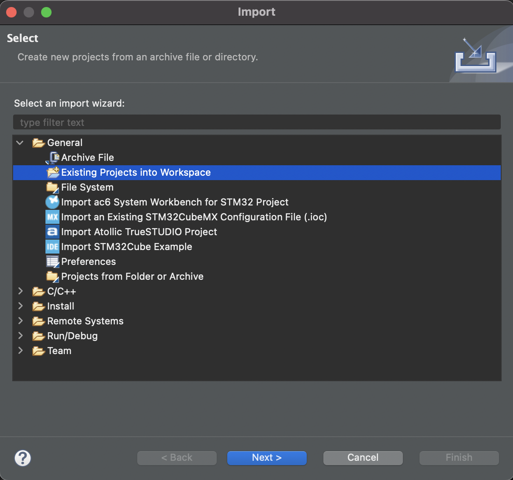  

- After the import, `TinyEngine_vww_training_tutorial` should be shown in Project Explorer of your STM32CubeIDE as the example figure below:

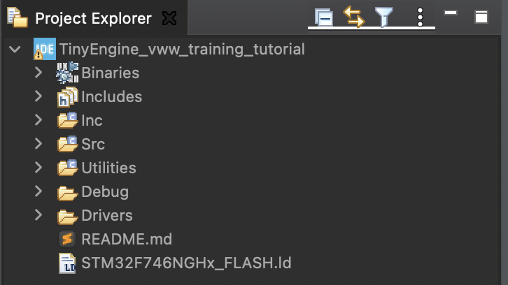

- Open `TinyEngine_vww_training_tutorial/Src/main.cpp`, as shown in the figure below:

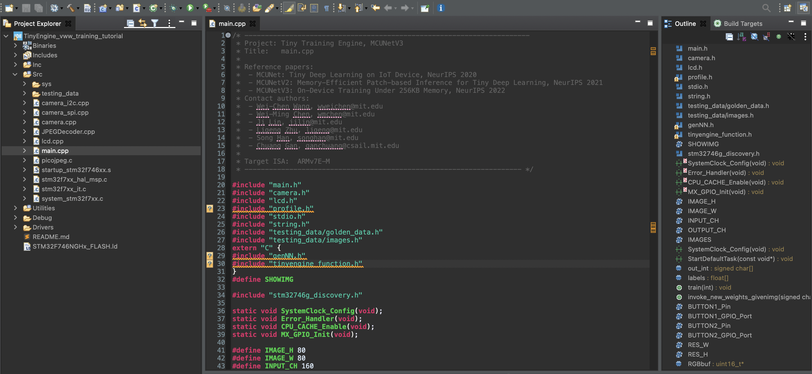

- Verify you have the correct compilation settings. (The default settings should be correct, but please follow the following steps to make sure that.):

  - Set the include paths of GCC compiler by \[Project\] -> \[Properties\] -> \[C/C++ Build\] -> \[Settings\] -> \[Tool Settings\] -> \[MCU GCC Compiler\] -> \[Include paths\] as the figure below:

  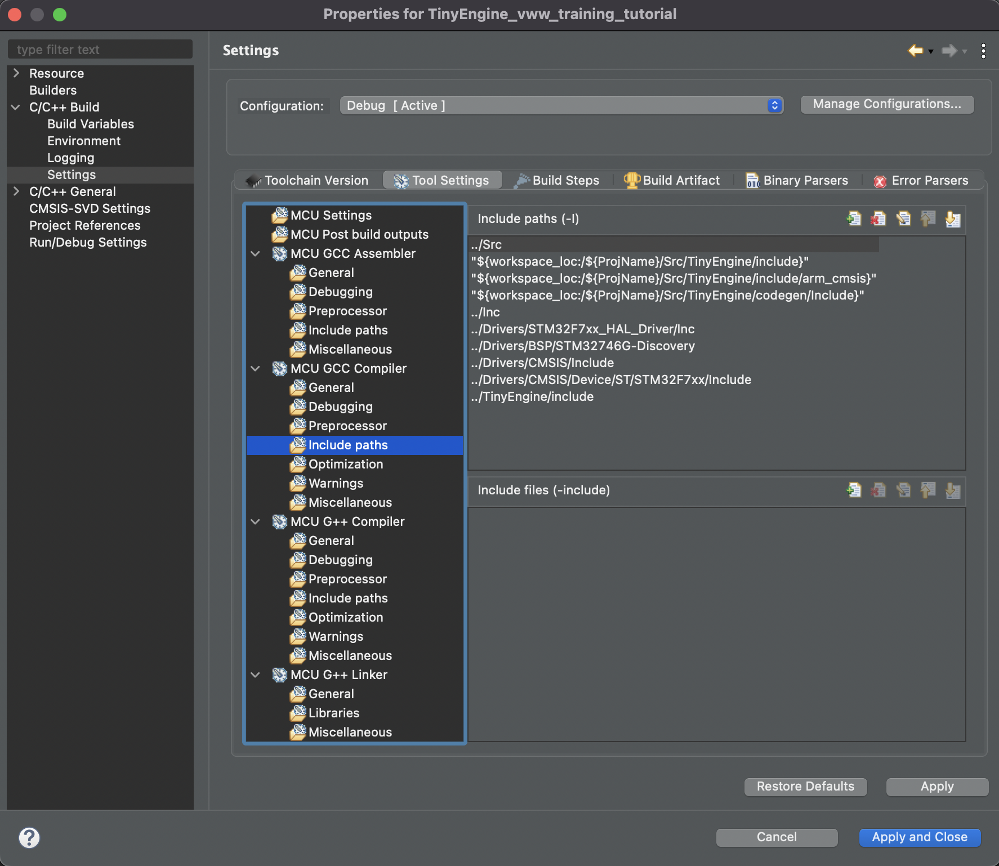

  - Set the optimization level of GCC compiler to `-Ofast` by \[Project\] -> \[Properties\] -> \[C/C++ Build\] -> \[Settings\] -> \[Tool Settings\] -> \[MCU GCC Compiler\] -> \[Optimization\] as the figure below:

  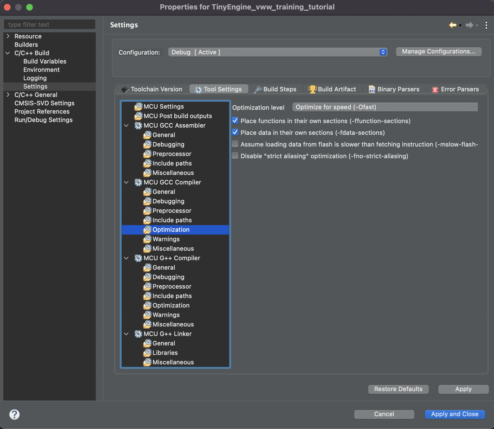

  - Set the include paths of G++ compiler by \[Project\] -> \[Properties\] -> \[C/C++ Build\] -> \[Settings\] -> \[Tool Settings\] -> \[MCU G++ Compiler\] -> \[Include paths\] as the figure below:

  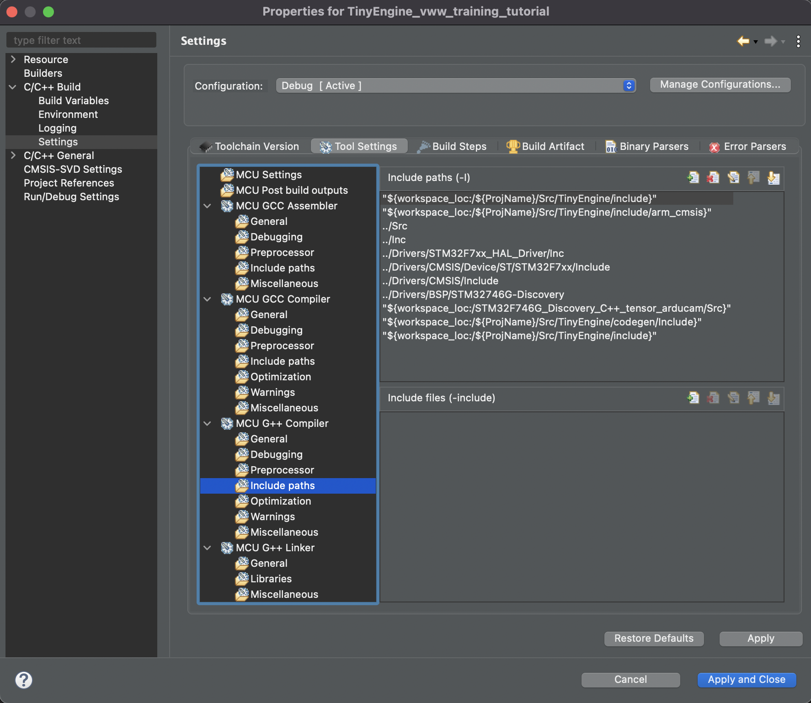

  - Set the optimization level of G++ compiler to `-Ofast` by \[Project\] -> \[Properties\] -> \[C/C++ Build\] -> \[Settings\] -> \[Tool Settings\] -> \[MCU G++ Compiler\] -> \[Optimization\] as the figure below:

  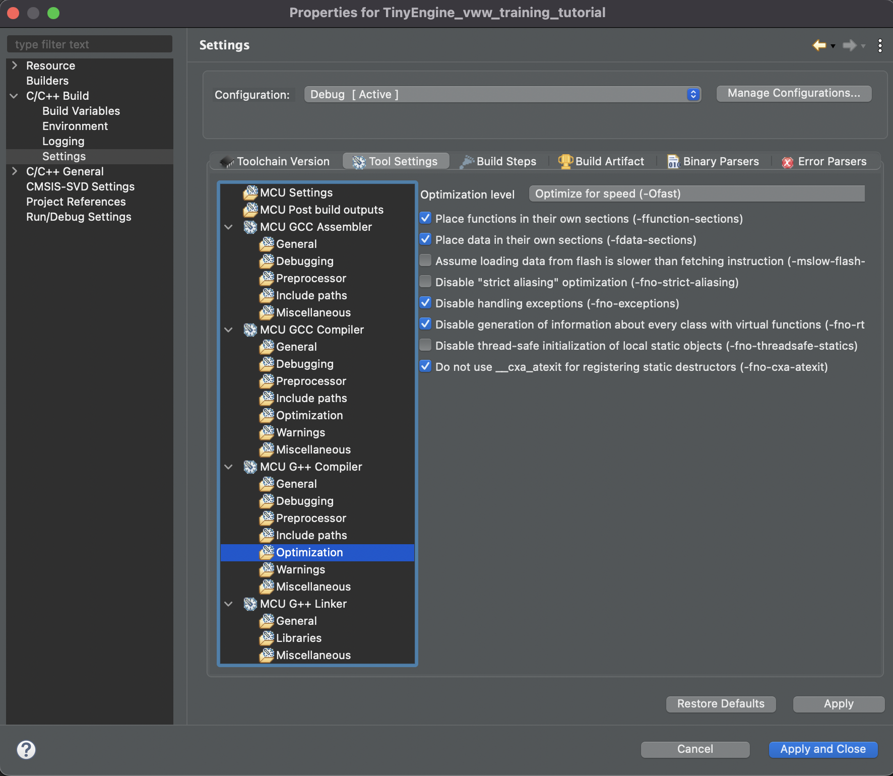

- Click \[Project\] -> \[Build Project\] to build/compile the program and generate the binary executable files.

- Set the run/debug configurations by \[Run\] -> \[Run Configurations…\] -> \[STM32 Cortex-M C/C++  Application\] -> \[TinyEngine_vww_training_tutorial Debug\] -> \[C/C++ Application\] -> \[Browse…\]:

  - Point to the correct elf file (file path: `Debug/TinyEngine_vww_training_tutorial.elf`) to correctly run the program, as shown in the figure below:

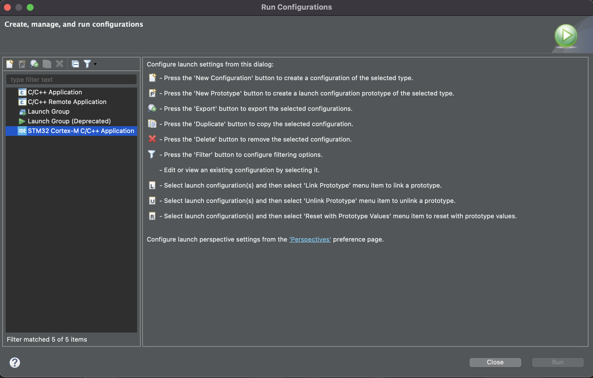  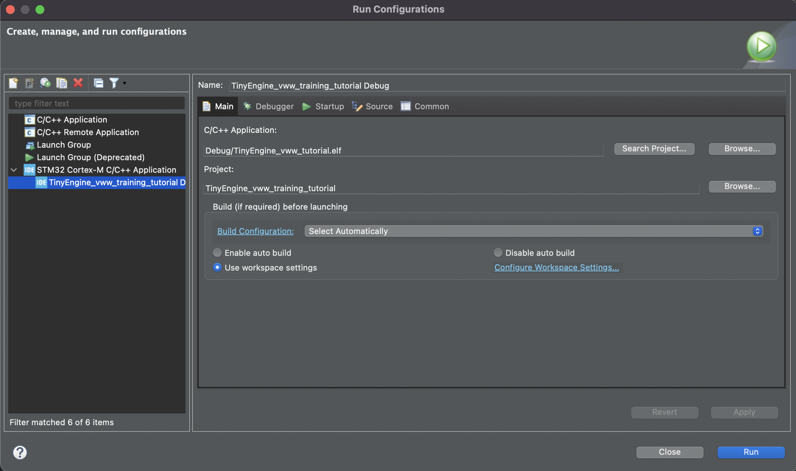

4. Setup your STM32F746G-DISCO discovery board to connect the Arducam to the board and also establish the USB connection with the board.

- Connect your Arducam to the board with jumper wires according to the following PIN connection:

  - SPI: MOSI->PB15(D11), MISO->PB14(D12), SCK->PI_1(D13), CS(NSS)->PI_0(D5), VCC-> 3.3V, GND->GND
  - I2C: SCL->PB8(D15). SDA->PB9(D14)

  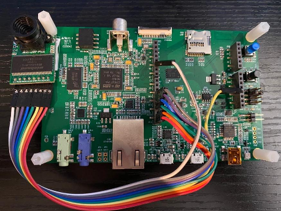
  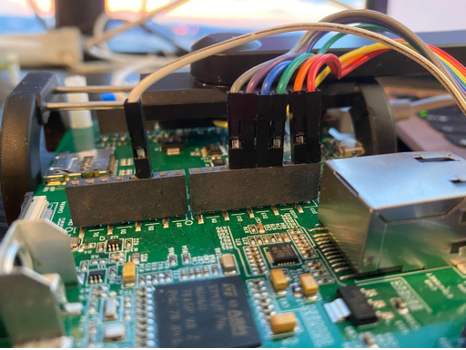

  ```
                  (Top view)                                       (Side view)
  ```

- Establish the USB connection with the STM32F746G-DISCO discovery board.

5. Now, let’s run the demo.

- Click \[Run\] -> \[Run\] to execute the binary executable file on your board.
- If the system requires updating the ST-LINK firmware, please first click “OK”:

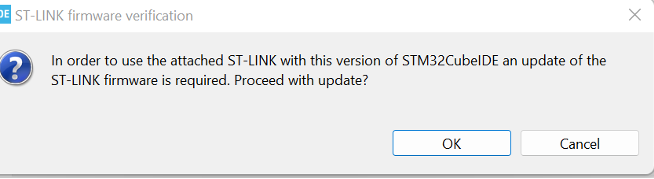

- Click “Open in update mode”:

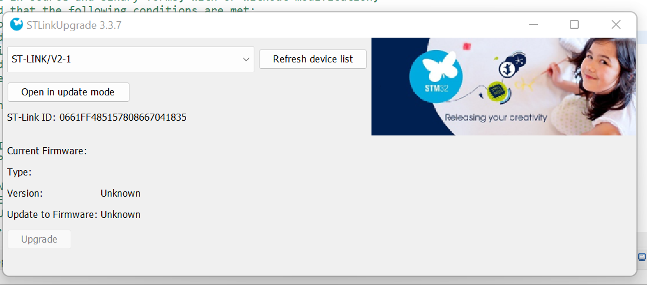

- Click “Upgrade”:

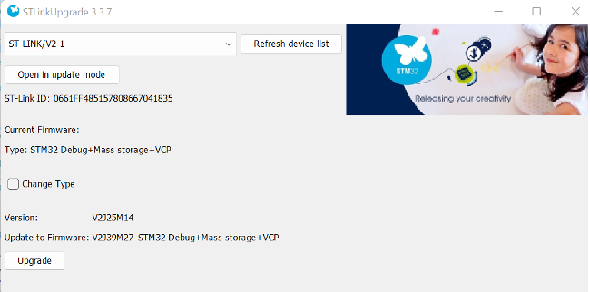

- Click \[Run\] -> \[Run\] in the STM32CubeIDE again.

6. If you successfully run the demo, the LCD screen on your STM32F746G-DISCO discovery board should display inference/training results and frames per second (FPS), as shown in the example figure below:

   
    

   ```
                      (Inference)                                                  (Training)
   ```
- The rules of controlling the inference/training modes are as follows: (The rules are defined in `main.cpp`)

  - Send "4" to the UART input for the MCU: Inference mode
  - Send "3" to the UART input for the MCU: Training mode
    - Send "2" to the UART input for the MCU: Set ground truth of training to "class 0"
    - Send "1" to the UART input for the MCU: Set ground truth of training to "class 1"

## Limitation

- Only tested the demo on STM32CubeIDE version 1.5.0.
